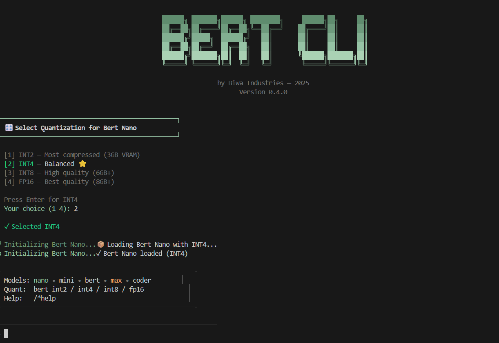

# BERT CLI

**A calm, local AI assistant by Biwa**


 ## ⚖️ Legal & Licensing
This is **Proprietary Software**. All rights are reserved by Biwa. 
- For licensing terms, see [LICENSE](./LICENSE).

---

## Overview

### About Bert:
![Bert CLI](https://img.shields.io/badge/Bert-598556?style=for-the-badge&logo=data:image/png;base64,iVBORw0KGgoAAAANSUhEUgAAAA4AAAAOCAYAAAAfSC3RAAABCGlDQ1BJQ0MgUHJvZmlsZQAAeJxjYGA8wQAELAYMDLl5JUVB7k4KEZFRCuwPGBiBEAwSk4sLGHADoKpv1yBqL+viUYcLcKakFicD6Q9ArFIEtBxopAiQLZIOYWuA2EkQtg2IXV5SUAJkB4DYRSFBzkB2CpCtkY7ETkJiJxcUgdT3ANk2uTmlyQh3M/Ck5oUGA2kOIJZhKGYIYnBncAL5H6IkfxEDg8VXBgbmCQixpJkMDNtbGRgkbiHEVBYwMPC3MDBsO48QQ4RJQWJRIliIBYiZ0tIYGD4tZ2DgjWRgEL7AwMAVDQsIHG5TALvNnSEfCNMZchhSgSKeDHkMyQx6QJYRgwGDIYMZAKbWPz9HbOBQAAACHUlEQVR42kXSy2pTURjF8f+3zzHmcpLehCalFCvWWooIVsFBoRcRh6IOWtA3cGAfoI+gL+DMF3DQiaCCDhQc2JaqFaSIsbV3m8TE5CTpOftzsKOO9mbDWmuwfzI6VVDPExBBBIwRRARVRRVEQBUAVBXUnUaMC7kANJohjWaIonieAUBcDuncBMEX3EoURyBwaXQMATa2tyhVq3QHWay1iOLmO02+iBDHMelkioVb8xyVKhzVKly7cJmNvS2evnlNJpkishYAXwxWFWOMUAtD7s7e4O3KKotPHvPpR5Fn79+RTaRYuDlHLQzpy+XoSmeIbIwAJopj+nI58kGWF2vLPLr/gInT55i5OEElrFOq/WJuchbf87k3fZ1Wu40Yg7GqJBMJXq0sMzI0xHGzzff9XVa/fOZsYZCvu9ucyec5LJfxPUNPOksUR/ie8ag3Q16urzHU34/vCSODBXrTAeIZKtXfWGsJTqbwBephE5Mw+O5jhO5shuL+Du2oRaVeY32zSNSyDBcGKO7sMjk+zubOHuVGg3yqCxmbGVDjCYKgKGJg8c48QTpJq3VM1I74dnBA2vd5uLREkE1hBGRs2gXpqImtJYoibl+5ynDfKbZLZTYPf/L8w0dyuRQnPINVkPNTBbfYISdGAKXSaKAxGBFiq/QEaccOwCr+X4f/Xq2CQG8m6EBxbq21dAw4CABqAVHESAe0W3H1+r/USUcV/gAs9ewGK9JGLAAAAABJRU5ErkJggg==&logoColor=white)

Bert is designed as a reliable AI assistant, something you can always rely on, you can see Bert as a Friend, as a service, as a companion, or as something else that you could value.

Bert has no fees, no limits, but ,he always wants to help, currently Bert has only his CLI incorporation, In beta phase, but we are expecting to develop a webpage where you can claim **your own token** which gives you access to Bert CLI and More, in a not so distant future, and also, we are expecting to get Bert a more solid version in *early-mid 2026*.

<p align="center">
  
</p>
 
**Models:**
- **Bert Nano** — Qwen2.5-0.5B (fastest, default) -  *2000 Tokens per answer*
- **Bert Mini** — Qwen2.5-1.5B (balanced) -  *3500 Tokens per answer*
- **Bert 1** — Qwen3-1.7B (flagship) -  *6200 Tokens per answer*
- **Bert Max** — Qwen3-4B (most capable) -  *12000 Tokens per answer*
- **Bert Coder** — Qwen2.5-Coder-1.5B (code-optimized) -  *7000 Tokens per answer*

---

## Installation

### From Source

```bash
git clone https://github.com/mnisperuza/bert-cli.git
cd bert-cli
pip install -e .

```

---

## Usage

### Start Bert
```bash
bert
```

### Command Line Options
```bash
bert --ver      # Show version
bert --info     # Show info
bert --del      # Remove Bert data (~/.bert)
bert --help     # Show help
```

### In-Session Commands

**Switch Models:**
```
bert nano       # Fastest (0.5B)
bert mini       # Balanced (1.5B)
bert            # Flagship (1.7B)
bert max        # Most capable (4B)
bert coder      # Code-optimized
```

**Change Quantization:**
```
bert int2       # Most compressed (win not supported via bitsandbytes)
bert int4       # Balanced ⭐ 
bert int8       # High quality 
bert fp16       # Best quality (all platforms)
bert fp32       # Full precision / CPU
```

**Other Commands:**
```
/*help          # Show all commands
/*status        # Show current status
/*clear         # Clear screen
/*exit          # Exit Bert
```

---

## System Requirements

| Component | Minimum | Recommended |
|-----------|---------|-------------|
| RAM | 4GB | 8GB+ |
| VRAM | 3GB | 6GB+ |
| Python | 3.8 | 3.10+ |
| Storage | 2GB | 10GB |

### Quantization Support

| Platform | INT4/INT8 | FP16 | FP32 |
|----------|-----------|------|------|
| Linux | ✅ | ✅ | ✅ |
| Windows | ✅* | ✅ | ✅ |
| macOS | ❌ | ✅ | ✅ |


---

## Configuration

Bert stores data in `~/.bert/`:
- `memory_*.json` — Conversation history per model
- `config.json` — User preferences
- `errors.log` — Error log (for debugging)

---

## Uninstall

Remove Bert data:
```bash
bert --del
```

---

## Support

- **GitHub Issues**: [github.com/mnisperuza/bert-cli/issues](https://github.com/mnisperuza/bert-cli/issues)

- **Email**: biwaindustries@gmail.com

When reporting issues, include:
1. Bert version (`bert --ver`)
2. Your OS (Windows/Linux/macOS)
3. Error message
4. Contents of `~/.bert/errors.log`

---

## License

Proprietary software by Biwa.  
This is beta software — use responsibly.

---

**Built with restraint and long-term intent.**  
**Biwa — 2025**
